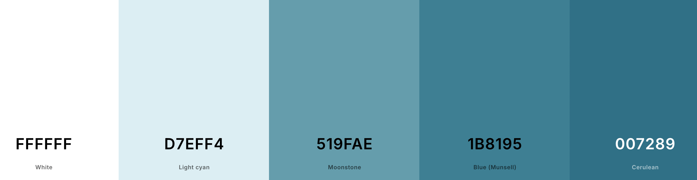
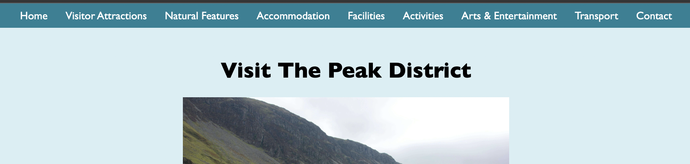

Welcome to the Peak District

Overview

"Peak District" is a comprehensive guide designed to help visitors discover the beauty, history, and attractions of the Peak District National Park. Whether you're a first-time visitor or a seasoned explorer, our website provides valuable insights to make your visit unforgettable.

User Targeted

Who:

* Nature Enthusiasts: Love hiking, wildlife, and scenic landscapes.
* History Buffs: Interested in historical sites and cultural heritage.
* Families: Looking for family-friendly activities and accommodations.
* Adventurers: Thrill-seekers for outdoor activities such as rock climbing, cycling, and water sports.
* Tourists: Travellers from around the world seeking information on the Peak District.

Why:

* To provide a one-stop resource for planning trips to the Peak District.
* To share detailed information about attractions, activities, and accommodations.
* To promote sustainable tourism and the preservation of natural and historical sites.

What:

* Attractions: Detailed descriptions of popular and lesser-known sites.
* Activities: Information on hiking trails, cycling routes, water sports, and other outdoor adventures.
* Accommodations: Recommendations for hotels, B&Bs, campsites, and other lodging options.
* Travel Tips: Practical advice on transportation, best times to visit, safety tips, and local customs.
* Events: Updates on local festivals, events, and activities happening throughout the year.

Color Scheme:

* Blue: Representing skies, lakes, and serenity.
The following website are what I used to find a color scheme I preferred for the information I would be displaying: 
* [Coolors](https://coolors.co/), [Material Palette](https://www.materialpalette.com/)

Imagery:

Imagery plays a crucial role in conveying the allure of the Peak District. The image resources below are what have been used to find free, relevant images, and to resize the images to ensure better loading times on the website when using different devices and networks.
* [Pexels](https://www.pexels.com/), [Pixabay](https://pixabay.com/), [Vecteezy](https://www.vecteezy.com/), [Megapixl](https://www.megapixl.com/), [Unsplash](https://unsplash.com/), [TinyPNG](https://tinypng.com/), [Simple Image Resizer](https://www.simpleimageresizer.com/).

Device Testing Throughout:

During the process of making my website I used a range of different devices to test the responsiveness of the website. 
I found issues with the website being used on phones, where the top nav bar and the footer wouldn’t stretch to either side of the page and was slightly squashed into the centre making it more difficult to read and use. The top nav bar also covered the title when viewed on phones as while it was squashed into the centre of the page, it was stretched down causing this to happen.
I fixed these issues with changes to the css making the nav bar stationary for use on phones, stretched out to the sides and the whole page to be moved down slightly, meaning the title was out of the way and couldn’t be covered by the nav bar.
The following list of devices are what I used to test my website while being built and afterwards to test any issues & changes:

* Pixel 6 pro 
* Pixel 8 pro
* iPhone 15 
* iPhone 12 
* Samsung galaxy 
* Samsung S22 Ultra 
* iPhone 13 
* iPad 
* MacBook Air  
* PC 

Resources and Acknowledgements:
Below shows some of the resources used to create a user-friendly website, that is presented in the best way possible.

Design: 

The design of "Explore the Peak District" is user-friendly and visually appealing, focusing on ease of navigation and an engaging user experience. The layout is clean and organised, ensuring that users can quickly find the information they need.

* [Coolors](https://coolors.co/), [Material Palette](https://www.materialpalette.com/)
* [Pexels](https://www.pexels.com/), [Pixabay](https://pixabay.com/), [Vecteezy](https://www.vecteezy.com/), [Megapixl](https://www.megapixl.com/), [Unsplash](https://unsplash.com/), [TinyPNG](https://tinypng.com/), [Simple Image Resizer](https://www.simpleimageresizer.com/).

Key Design Elements:

* Responsive Design: Optimised for various devices, including desktops, tablets, and smartphones.
* Navigation Menu: Clear and intuitive menu categorising information into Attractions, Activities, Accommodations, Travel Tips, and Events.
* Search Functionality: A powerful search bar allowing users to quickly locate specific information.
* Photo Galleries: High-quality images showcasing the beauty of the Peak District.

Navigation:

I chose to have a navigation bar at the top of the webpage as this allows easy navigation throughout the site. This helps most users find their way through the website as easily as possible.
On larger devices (tablets/ipads etc) the navigation bar moves over the page as you scroll, this is helpful as you can switch to another page at any point.
On smaller devices (phones etc) the navigation bar is stationary at the top of the page as you scroll, this is because there isn't as much space on the screen and this allows for more space to view images and read the information presented.

There is also a footer which contains a link to each page. This is stationary on every page, and just purely there for practical reasons, especially on phones where the navigation bar doesn't follow the page. This just shows the pages and contains my Copyright tag.

When you hover over the titles of each section, it changes colour slightly and underlines to show it is a link. Each link takes you to an external page, either the wikipedia for more information, or a booking site for the accommodation etc.
Layout:

The Current Layout Structure:

The current layout of the website is to have a title, then an image, showcasing the piece of information below.

Future Layout Structure Plans:

I would like to re-arrange the layout to have a title, then an image and place the information to the right of the image, then the one below the information would be to the left of the image. This will give the website more of a newpaper/magazine look and feel to it.

Website Building:
* [W3Schools](https://www.w3schools.com/), [Validator](https://validator.w3.org/), [Responsinator](http://www.responsinator.com/).

Validator scores: 

The HTML validator came back with the hr tag being out of place, however this is what is used to create a break between the webpage and the footer and there was no way of changing this so the HTML validator accepted it.

The CSS validator came back clear with no known issues.

Acknowledgements: 

* Special thanks to friends and family for providing invaluable feedback and participating in real user testing, helping to refine and improve the website.

Testing User Stories

Below will explain how I achieved my user goals on this website:

* The website consolidates essential information on the Peak District, including guides to visitor attractions, natural features, activities, and accommodations, providing a one-stop resource for trip planning.
* It offers in-depth descriptions of various attractions and accommodations, allowing visitors to make informed decisions about where to stay and what to do.
* By highlighting the historical and natural significance of the Peak District, the website encourages sustainable tourism practices and promotes the preservation of these sites.

Real User Testing Feedback:

I gave 5 different types of people a questionnaire to fill out after using and testing my website, below is their answers, summarized, including things to improve:

* Design and Layout:
    * Clean, simple, and easy to navigate.
    * Works well on both desktop and mobile devices.
    * Attractive images showcasing the Peak District.
* Navigation:
    * Easy to find information with well-defined categories.
    * Efficient top navigation bar and a secondary bar for quick access.
    * All links and buttons function correctly.
* Content Clarity:
    * Clear, detailed, and easy-to-understand content.
    * Balanced detail without overwhelming the user.
* Visual Appeal:
    * Good colour scheme, visually appealing fonts, and images.
    * Consistent art style and structure.
* Functionality:
    * No issues with links, forms, media, or interactive elements.
    * Quick loading times with no delays.
* Responsiveness:
    * Performs well on desktop, tablet, and smartphone.
    * Scales smoothly to different screen sizes and resolutions.
* User Experience:
    * Enjoyable to use, with no frustrating aspects.
    * Detailed and interesting descriptions of places.
* Accessibility:
    * No barriers to accessing any part of the website.
    * Good colour contrast and general accessibility.

Overall Summary

* Users were very satisfied with the website overall, rating it highly in terms of design, functionality, and user experience.

* Suggestions for improvement included:
    * Changing the hotel to one closer to the Peak District.
    * Linking the tourist information centre to the Peak District one.
    * Adding addresses and locations for mentioned places.
    * Including more examples of things in the Peak District and additional information about disabled facilities and parking.
    * Highlight "Miles without Stiles" trails for people with mobility issues.
    * More multimedia content like videos.
    * Include addresses or interactive maps for easier navigation.
    * Clarify that titles of places link to their respective websites.
    * Consider adding different language options for non-English speaking visitors.